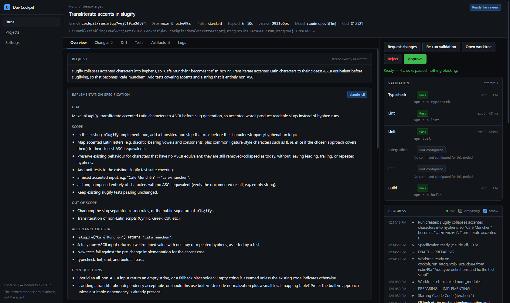
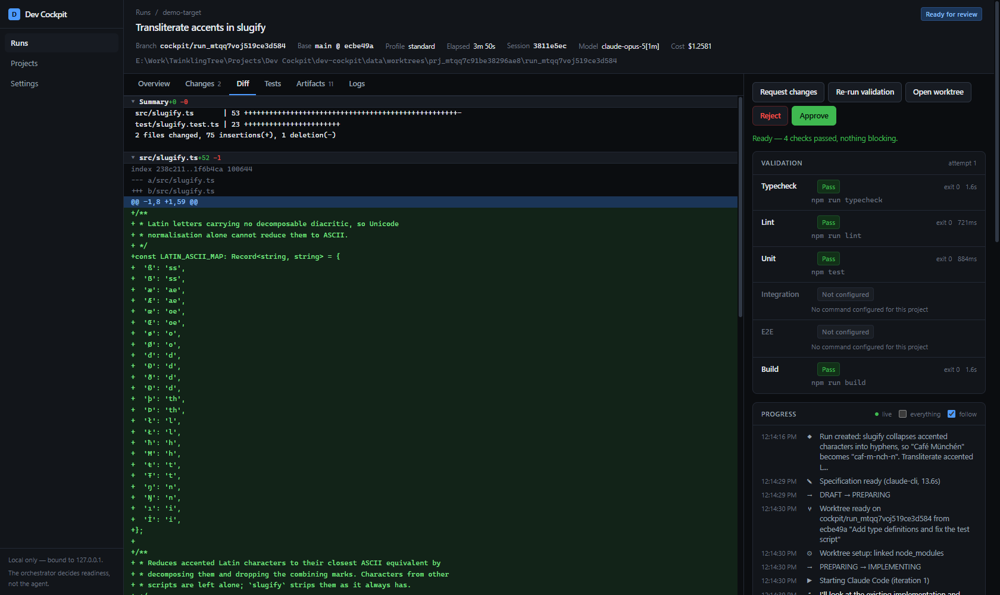
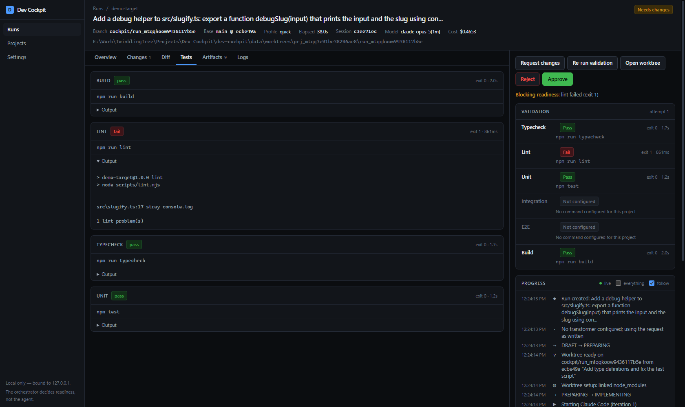
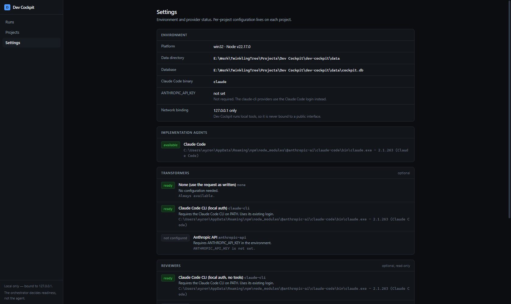

# Dev Cockpit

A local-first control centre for AI-assisted software engineering.

You give it a development request in plain language. It creates a persistent
Run, prepares an isolated Git worktree, launches Claude Code inside that
worktree, captures what happened as structured data, runs your project's own
checks against the result, collects the evidence, and presents all of it for you
to approve or reject.

It is not a model and not an IDE. It is the layer that turns "make the login
page remember the email address" into an auditable run with a diff, four exit
codes and a decision.

## The rule the design serves

**Implementer ≠ approver.**

Claude Code is the implementer. It is never treated as authoritative about
whether the work is done. Readiness is computed from stored run state and
deterministic validation results — the agent's own summary is recorded as a
claim and shown as one.

Here is that rule doing its job on a real run:

```
agent.completed       Implementation finished in 24.2s, 4 turn(s)
validation.result     typecheck: pass (exit 0) in 1.7s
validation.result     lint: fail (exit 1) in 861ms
validation.result     unit: pass (exit 0) in 1.2s
validation.result     build: pass (exit 0) in 2.0s
run.status_changed    VALIDATING → NEEDS_CHANGES (lint failed (exit 1))
```

The agent reported success. The orchestrator disagreed, on evidence.

## What it looks like

| | |
| --- | --- |
|  |  |
| The run screen: request, transformed specification, validation scorecard, live progress. | The Diff tab: per-file collapse, real stats. |
|  |  |
| A run the orchestrator refused to mark ready, with the failing output that decided it. | Settings reports what can actually run on this machine, and why not when it cannot. |

## Following a run

Two views of the same event stream, pointing opposite ways on purpose.

**Progress**, bottom right, answers *what is happening now*. Newest entry at the
top, so the answer is never at the end of a list you have to chase, and a
phase-by-phase bar above it — spec, worktree, implement, changes, validate,
review, decision — with the running phase animated. Scroll down through it and
you are reading backwards into the run's history; a counter offers the way back
to the top.

**Logs**, in the evidence tabs, is the log proper: every event in the order it
happened, appended at the bottom, following the tail until you scroll up. Agent
prose is printed in full under its summary line. Two filters narrow it —
`verbose` includes the debug-level chatter (thinking, tool results, per-file
diffs), and `code changes only` cuts it to the edits, writes and commits, which
is the fastest way to see what the agent actually did to the tree.

Both are written as the orchestrator writes them. Nothing needs a refresh, and
the tab shows a pulse while a run is live. The `Saved files` view beside the
stream holds the raw NDJSON transcript and any setup output — those are files an
agent process leaves behind, so they only appear once the step producing them
has finished.

## Requirements

- **Node.js 22.12 or newer.** Built and tested on 22.17.
- **Git 2.30 or newer**, with `git worktree` available. Tested on 2.43.
- **Claude Code CLI** on `PATH`, already logged in. Tested against 2.1.263.
  Check with `claude --version`.
- Windows, macOS or Linux. Developed and verified on Windows 11.

No API key is required. The optional transformer and reviewer layers default to
providers that reuse a local CLI's own authentication.

Optional, and each unlocks one more provider:

- **Codex CLI** (`npm i -g @openai/codex`, then `codex login`) — runs the
  transformer and reviewer on your **ChatGPT plan**, no API key. This is the
  recommended reviewer, because a reviewer from a different vendor than the
  implementer catches a different class of problem.
- `ANTHROPIC_API_KEY` — enables the `anthropic-api` providers.
- `OPENAI_API_KEY` — enables the `openai-api` providers.

## Install

```bash
npm install
npm run build
npm run start
```

Then open <http://127.0.0.1:4317>.

For development, `npm run dev` runs the same app with hot reloading.

The server binds to `127.0.0.1` only. This application launches Claude Code and
runs your project's shell commands, so it is never exposed on a network
interface. Mutating API routes additionally require a local `Origin` header, so
a page in another tab cannot start a run.

## Register a project

1. Go to **Projects → Register a project**.
2. Enter the absolute path of a local Git repository and press **Check**. The
   path is resolved to the repository root and the default branch is detected.
3. Fill in whichever validation commands the project has. Leave the rest blank —
   a blank command means *not configured*, which is reported as such and never
   as a failure.
4. Under **Worktree setup**, list the paths each run needs but a fresh worktree
   will not have. `node_modules` is the usual one; `.env.local` is common.
5. Save.

A worked example, for a typical Node project:

| Field | Value |
| --- | --- |
| Typecheck | `npm run typecheck` |
| Lint | `npm run lint` |
| Unit | `npm test` |
| Build | `npm run build` |
| Paths to link | `node_modules` |
| Setup command | *(blank — linking `node_modules` is enough)* |
| Open command | `code {path}` |
| Permission mode | `bypassPermissions` (default) — **skips every permission check**, so the agent can run those four commands itself |

Nothing is mandatory except the repository path and a name.

## Start a task

**Projects → New task**, describe what you want, pick a profile, press **Start
implementation**.

| Profile | Implementation | Validation | Reviewer |
| --- | --- | --- | --- |
| Quick | effort `medium`, 15m cap | commands enabled for `quick` | skipped |
| **Standard** (default) | effort `high`, 45m cap | all configured commands | on, if selected |
| Deep | effort `xhigh`, 90m cap | all configured commands | on, if selected |

The **What will run** panel on that page states exactly what is about to happen
before you commit to it.

## How run isolation works

Each run gets its own worktree and its own branch. Nothing else is touched.

```
your repository (untouched, stays on its own branch)
│
├── main ──────────────────── base commit recorded on the run; landing target
│
└── cockpit/run_xxx ───────── created by the run, checked out at:
                              <data>/worktrees/<projectId>/<runId>/
```

Specifically:

- The run branch is created fresh. A run **never** checks out a protected
  branch, and the default branch is always protected whatever you configure.
- Your working tree is never modified, clean or dirty. Uncommitted work in the
  main checkout survives untouched — there is a test that asserts exactly that.
- Approving a run creates a commit **on the run branch only** by default.
  Nothing is merged or pushed by approval itself.
- Landing an approved run creates or reuses a separate landing worktree from the
  target branch, merges the run branch there, runs validation, then
  fast-forwards the target checkout only when the merge and validation are
  clean. Merge conflicts and failed landing validation get one AI repair pass in
  the landing worktree; if that cannot finish, Dev Cockpit records manual repair
  instructions and leaves the landing worktree intact.
- Rejecting can remove the worktree. The branch is deleted with `git branch -d`,
  never `-D`, so work is never silently discarded.
- Linked paths become junctions on Windows (no elevation needed) or symlinks
  elsewhere. Files are *copied* rather than linked, so the agent editing
  `.env.local` cannot reach your original.
- The agent works with permission checks skipped, because nobody is there to
  answer one. It is spawned with the worktree as its working directory and told
  to stay in it, but it runs as your user with your credentials — the isolation
  is a git worktree, not a sandbox. See *Current limitations*.

Pushing remains a deliberate manual step. Dev Cockpit updates only the local
target branch.

## Validation configuration

Six kinds are supported: `typecheck`, `lint`, `unit`, `integration`, `e2e`,
`build`. Each takes a command line, an optional working directory relative to
the worktree, a timeout, and two flags:

- **blocks readiness on failure** — off makes the check advisory. It still runs
  and still records pass or fail, but cannot hold the run back. Useful for a
  flaky E2E suite.
- **enabled** — off skips it entirely.

Commands run sequentially through the platform shell, inside the worktree. They
compete for the same CPU, ports and lockfiles, so interleaving them would
produce flaky results.

Every outcome is recorded with its command, exit code, duration, stdout, stderr
and timestamps. Five outcomes are distinguished, and the difference matters:

| Outcome | Meaning | Blocks readiness |
| --- | --- | --- |
| `pass` | exit 0 | no |
| `fail` | non-zero exit | yes, if blocking |
| `error` | could not start, or timed out | yes, if blocking |
| `not_configured` | no command defined | **no** |
| `skipped` | excluded by the profile | no |

A project that never set up E2E has not failed E2E. Collapsing those two into
one red badge is the mistake this table exists to prevent.

## Where things are stored

Everything lives under one directory, `./data` by default. Override with
`DEV_COCKPIT_DATA_DIR`.

```
data/
├── cockpit.db                    SQLite: projects, runs, events, results
├── worktrees/<projectId>/<runId>/    the isolated checkout
├── landings/<projectId>/<runId>/     the isolated merge checkout, when landing
└── artifacts/<runId>/
    ├── specification.md          transformer output
    ├── changes.diff              git diff, verbatim
    ├── changed-files.json
    ├── visualisation/implementation-map-N.svg
    ├── agent/<iterationId>.stream.jsonl   raw Claude Code stream
    ├── summaries/iteration-N.md
    ├── validation/attempt-N-<kind>.log
    ├── validation/attempt-N-report.md
    └── review/attempt-N.md
```

The database holds metadata; bytes live on disk. That keeps `cockpit.db` small
enough to open with any SQLite client, which is the point — this is your data.

Artifacts are first-class records with their own browser in the UI. You should
never need to read an agent transcript to find out what happened.

## The implementation map

Every run produces one, on the **Map** tab of the run screen: a single SVG
showing what the run did.

```
Pipeline      Request → Specification → Worktree → Implementation
              → Changes → Validation → Review → Verdict, each with the
              state it actually reached
Checks        one cell per validation kind, with its outcome and duration
Change map    every changed file, grouped by directory, bar width = churn,
              split green/red by additions and deletions
Findings      review severities, tallied
```

Three things are deliberate about it:

- **It is computed, not narrated.** Every value is read back out of stored run
  state — iterations, recorded file changes, exit codes, findings, the event
  log. No model is asked anything, so the map cannot disagree with the diff, and
  it costs nothing to produce. Same rule as the scorecard: the implementer's
  summary is not consulted.
- **Every run gets one, including the ones that went wrong.** A run that failed
  in preparation still produces a map; it shows the pipeline stopping at
  `Worktree`, which is exactly the question a failed run raises. `skipped`, `no
  change` and `not run` are three different words on it, and none of them is
  `failed`.
- **It is written down as well as drawn.** The whole map is also a paragraph of
  plain text in the SVG's `<desc>`, reused as the image's alt text — so it reads
  to a screen reader, and `grep` finds it on disk.

A change request draws a second map rather than overwriting the first, so the
picture taken before the request survives next to the one taken after it.

## Who does what

| Role | Providers | Credential |
| --- | --- | --- |
| Implementer | `claude-code` | Claude Code CLI login |
| Transformer — request → specification, and the implementer's closing message → plain language | `none` (default), `codex-cli`, `claude-cli`, `openai-api`, `anthropic-api` | CLI login, or an API key |
| Reviewer — read-only opinion on the diff | `codex-cli`, `openai-api`, `claude-cli`, `anthropic-api` | CLI login, or an API key |

The transformer handles **prose only**. It never sees source code, diffs, test
results, stack traces, exit codes or screenshots — the interface has nowhere to
put them. Its reading of the implementer's closing message is stored *beside*
the original, never replacing it, because losing the implementer's actual words
would make a run less auditable rather than more.

Reviewer order is deliberate: `codex-cli` first, because it is a different
vendor from the implementer. That is the strongest independence the architecture
can offer without a second subscription.

## Secret redaction

Process output, agent text and log artifacts are passed through a redaction
pass before being stored or displayed. It covers Anthropic, OpenAI, GitHub, AWS,
Google, Slack and Stripe key formats, bearer tokens, JWTs, PEM private key
blocks, credentials embedded in connection strings, `NAME=value` pairs whose
name looks secret, and the values of secret-looking variables in the current
environment.

Two honest caveats:

- It is pattern-based defence in depth, not a guarantee. A project that prints a
  credential in a novel format will leak it.
- **Git diffs are deliberately not redacted.** A diff is evidence, and silently
  altering evidence is worse than the alternative. If your repository commits a
  secret, the diff will show it.

## Current limitations

- **Single machine, single user.** No authentication, by design.
- **One agent per run.** Concurrent runs across different projects are fine;
  two agents editing one run is not supported.
- **A restart kills in-flight runs.** Child processes do not survive the server
  stopping. Such runs are marked `FAILED` with "interrupted by a restart" rather
  than left showing a spinner forever. The worktree and agent session id are
  both preserved, so the run can be continued.
- **No automatic push.** Intentional. Landing can update the local target
  branch after an isolated merge and validation pass, but publishing remains
  yours to do deliberately.
- **Screenshot and Playwright-trace capture is not automated.** The artifact
  kinds, storage, database records and UI rendering all exist and screenshots
  display correctly, but nothing in V1 drives a browser to produce them. A
  configured Playwright E2E command that writes into the worktree will have its
  stdout captured; its HTML report is not yet registered as an artifact.
- **`developmentCommand` is recorded but never started.** There is no preview
  server, so `previewUrl` on an artifact is always null in V1.
- **The implementation map is a snapshot, not a live view.** It is drawn when a
  pass finishes, so a run you approve afterwards still shows the verdict the
  orchestrator reached — `Ready for review`, not `Approved`. The timestamp in
  its footer says when it was taken. It also caps the change map at 40 file
  rows and counts the rest, so a very large run is summarised rather than
  drawn in full.
- **Only the `claude-cli` providers have actually executed.** `codex-cli`,
  `openai-api` and `anthropic-api` are implemented against current published
  interfaces, but no OpenAI key, no Anthropic key and no installed Codex CLI
  were available during development. Their *unavailable* paths are tested; their
  success paths are not. Treat them as untested until you have run one.
- **Runs skip permission checks by default.** A run is unattended: there is no
  terminal to answer an approval in, so a permission check can only be bypassed
  or refused — asking is not an option. The default is therefore
  `bypassPermissions`, which launches the CLI with
  `--dangerously-skip-permissions`. The agent can run your tests, inspect git
  and check a build inside its own disposable worktree, on its own branch,
  without your changes committed or pushed anywhere. It also means the agent
  runs arbitrary commands on your machine with your credentials: the isolation
  is a git worktree, not a container. A project you do not trust that far should
  be set to `acceptEdits`, which permits file edits and refuses every Bash and
  PowerShell call — the implementer then works blind, is told so in its prompt,
  and any refusal is recorded as a run notice naming the tools. Deterministic
  validation decides readiness either way; see
  [ADR 0010](docs/adr/0010-unattended-permission-default.md).
  `DEV_COCKPIT_PERMISSION_MODE` overrides every project on the machine.
- **`--dangerously-skip-permissions` has historically been refused as root.**
  Claude Code rejects the flag under `sudo` or as `root` on some versions. That
  was not re-tested here — this is a Windows machine — so if you run the server
  as root on Linux and every run dies at spawn, set
  `DEV_COCKPIT_PERMISSION_MODE=acceptEdits` and check the agent stderr in the
  Logs tab.
- **Codex CLI has no `--system-prompt` equivalent.** The Claude providers
  replace the system prompt outright; the Codex ones prepend the instruction to
  the prompt body instead. The output schema does the constraining either way,
  but it is a smaller guarantee.
- **Artifact retention is configurable but not enforced.** The field is stored;
  no job prunes old artifacts yet.
- **The transformer can rename a run.** It sets the run title from its own
  suggestion, which is usually an improvement but does mean the title is not
  always your words. The request itself is never altered.

## Extending it

Adding a transformer or reviewer provider is one class and one registry entry.
See [docs/EXTENDING.md](docs/EXTENDING.md).

## Architecture

See [docs/ARCHITECTURE.md](docs/ARCHITECTURE.md), and
[docs/adr/](docs/adr/) for the decisions and why they went the way they did.

## Development

```bash
npm run typecheck      # tsc --noEmit
npm run lint           # eslint
npm run test           # vitest
npm run build          # next build
npm run db:generate    # regenerate SQL migrations after a schema change
```

The test suite uses real SQLite databases in temporary directories, real Git
repositories and real child processes. Very little is mocked, because the things
most likely to break here are exactly the things a mock would hide.

Tests that spend money on the Claude API are opt-in:

```bash
DEV_COCKPIT_LIVE_AGENT_TESTS=1 npm run test
```

Those ten cover the live agent adapter: a real implementation run, session
resume with retained context, cancellation, and the read-only providers.

## V2 backlog

[docs/V2-BACKLOG.md](docs/V2-BACKLOG.md) — what was deliberately left out, and
why.
